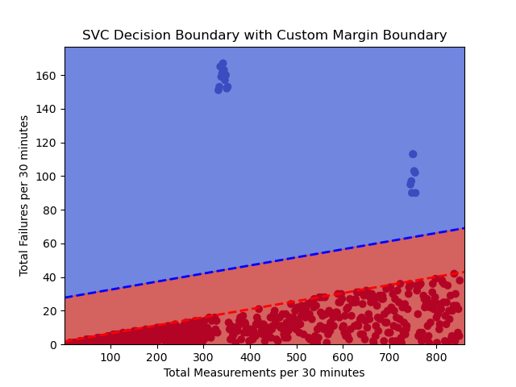

# ml-classification-alarms  

Author: Erin James Wills, ejw.data@gmail.com


<cite>Photo by <a href="https://unsplash.com/@hjrc33?utm_source=unsplash&utm_medium=referral&utm_content=creditCopyText">Héctor J. Rivas</a> on <a href="https://unsplash.com/photos/2Axr8NAAqng?utm_source=unsplash&utm_medium=referral&utm_content=creditCopyText">Unsplash</a></cite>  

```
Status:  Proof of Concept Complete.  See Future Improvements section for details.  
```
  
## Overview

The purpose of this project is to show how machine learning could be used to validate alarm/alert settings for system monitoring.  Alarm metrics notify you when the system is not behaving in an expected manner.  The original metrics might have been created based on the information available but will often change over time.  The metrics are often changed when it is realized the system did not catch a particular scenario or there is an increase in overall alarms that are triggered.  

This project shows that clustering techniques could be used to identify outliers and a modified classification model could be used to identify the near optimum metrics to use.  This technique is something that could be run to obtain the metrics and rerun to monitor if the metrics are changing with time and need updating.  

  
<cite>Example of Failures PLotted with the SVC Boundary Condition (Blue Dotted Line) and a Modified Margin (Red Dotted Line).</cite>

## Concepts

The data used in this example was synthetically made and only represents a common issue that I found in the chemical industry while monitoring processes.  The same concept could be applied to many industries and applications.  The data represents the number of failures observed per 30 minutes.  In a real system, there are a natural number of failures that occur and it typically occurs at a maximum rate or less.  There errors are accepted and considered normal and don't significantly harm anything.  Since these errors occur at a pretty consistent rate, the main factor that influences total failures is the total volume of events during that 30 minute period.  This forms a linear boundary with most measurements being non-outliers and only a small number of measurements greatly deviating from the rest.  

The process of auto-decting these points can be accomplished by using a clustering method to level the point as not being a part of the main cluster.  This labeled data can then be used to calculate the decision boundary through a classification method.  Finally, the boundary might not fit too tightly to the non-outliers so the boudnary can be shifted downward unti it touches the first measurement.  The equation of that line tells us two things: 1) What is the minimum number of samples each 30 minute period must have to cause an alarm (matches y-intercept) and 2) What is the failure rate (or success rate = 1 - failure rate) of the system (matches the slope of the boundary).  Minimum mesurements and minumum success rate are often used in alarm metrics.  

One other concept that should be explained here - in this example, the data is an aggregate of 30 minutes of data.  This is often not a rolling 30 minutes but a discrete calculation that occurs every 30 minutes.  The specific time when the calculation occurs is arbitrary so to enlarge the dataset, I calculated the number of failures for every possible combintation based on the beginning of each minute for the entire day.  This will show all the possible alerts that could have occurred if the time of the calculation was different.  

### Clustering Methods  
There are several models that I will test to see how each perform.  Initially I thought Isolation Forests and One-Class SVM might work the best but I wanted to chart the boundaries and check the parameters sensitivity to see how effective each algorithm is.  In the end, I chose to use Isolation Forests to label the outliers.  

1.  `Isolation Forest`: The Isolation Forest algorithm is effective at identifying outliers by isolating them into small clusters or leaves in a binary tree. It works well for detecting anomalies that are far from the majority of data points, making it suitable for linear data with outliers.

1.  `Local Outlier Factor (LOF)`: LOF measures the local density deviation of a data point compared to its neighbors. Outliers are those data points with significantly lower density than their neighbors, which makes it suitable for identifying outliers in linear relationships.

1.  `One-Class SVM (Support Vector Machine)`: One-Class SVM is used for novelty detection and is particularly useful for identifying outliers in high-dimensional spaces. It can be adapted to detect data points that do not fit the expected linear pattern.

1.  `Elliptic Envelope`: The Elliptic Envelope algorithm fits a robust elliptical envelope around the majority of the data points, and data points outside this envelope are considered outliers. It can be effective for identifying outliers in linear data.

1.  `DBSCAN (Density-Based Spatial Clustering of Applications with Noise)`: While DBSCAN is primarily a clustering algorithm, it can also be used to detect outliers. Points that do not belong to any cluster (considered noise) can be considered outliers, including those that do not follow a linear relationship.

1.  `Autoencoders`: Autoencoders are a type of neural network used for unsupervised learning. They can be trained to learn the underlying linear relationship in the data and then identify outliers as data points that do not fit this learned representation.

1.  `Z-Score or Modified Z-Score`: These are simple statistical methods where you calculate the z-score (or modified z-score) for each data point based on its deviation from the mean and standard deviation of the data. Data points with high z-scores can be considered outliers.

1.  `Mahalanobis Distance`: The Mahalanobis distance measures the distance between a data point and the centroid of the data while taking into account the covariance structure of the data. Data points with large Mahalanobis distances can be considered outliers.  


### Classification   

I selected a couple classification algorithms to test on this problem.  I thought that either Logistic Regresssion or a Support Vector Classifier would work best due to the simplicity of finding the decision boundary.  

1.  `Logistic Regression`:  Logistic regression is a machine learning technique for binary classification that models the relationship between input features and the probability of a binary outcome. It uses a logistic function to transform a linear combination of features into a probability score between 0 and 1.  

1.  `SVC`:  A Support Vector Classifier (SVC) is a machine learning model used for classification tasks. It finds the hyperplane that best separates different classes of data while maximizing the margin between them, making it effective for complex decision boundary problems.  

## Future Improvements  

1.  Create multiple datasets - each dataset should be timestamp records that indicate if there was an error or not.  The data can then be aggregated into 30 minute periods like the current data is formatted.  This will make the example less abstract and show the preprocessing of the data that is needed before the machine learning can begin.  
1.  Create a pipeline that will run all the steps on all the datasets.
1.  Store results in a file and create a dashboard that can indicate current parameters and any significant changes from the previous analysis.  